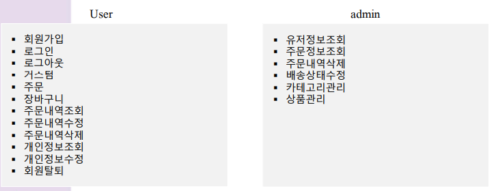
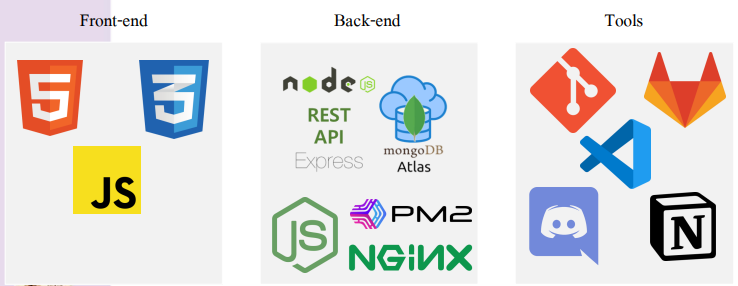
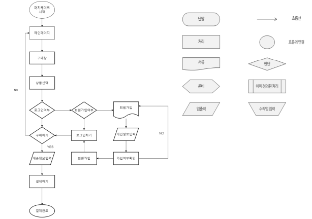

# 🍰 MergeCake 

> 원하는 모양으로 케이크를 만들고 🎂  장바구니에 추가하고 🧸,
> 또 주문을 할 수 있는 쇼핑몰 웹 서비스 제작 프로젝트입니다.  
 

## ✅ 시연 영상

회원가입

로그인

일반 회원 - 주문 

일반 회원 - 회원 정보 RUD

관리자 - 주문 내역 RUD

관리자 - 회원 관리 RD

관리자 - 카테고리 & 상품 CRUD

 

## ✅ 페이지별 화면

|  |  |
| ------------------------------------------------------------------------------------------------------------- | -------------------------------------------------------------------------------------------------------------|
|  |  |
| 메인 페이지 | 회원가입 |
|  |  |
| 로그인 | 케이크 주문 과정 |
|  |  |
| 결제 | 일반 회원 - 주문 관리 |
|  | |
| 일반회원 - 정보 관리 | 관리자 - 주문 관리 |
|  |  |
| 관리자 - 회원 관리 | 관리자 - 카테고리 관리 |

### 💡 배포링크
http://kdt-sw3-team09.elicecoding.com/
 

### 서비스 소개

1. 회원가입, 로그인, 회원정보 수정 등 **유저 정보 관련 CRUD** 
2. **제품 목록**을 조회 및, **제품 상세 정보**를 조회 가능함. 
3. 장바구니에 제품을 추가할 수 있으며, 장바구니에서 CRUD 작업이 가능함.
    - 장바구니는 서버 DB가 아닌, 프론트 단에서 저장 및 관리 (localStorage)
5. 장바구니에서 주문을 진행하며, **주문 완료 후 조회 및 삭제**가 가능함.
6. 다음 우편번호 api 사용하여 주소입력 가능.
7. nodemailer 사용 - 임시 비밀번호 발급 가능.
 

 

### 기술 스택

 

### 인프라 구조

 

#### 폴더 구조
- 프론트: `src/views` 폴더 
- 백: src/views 이외 폴더 전체
- 실행: **프론트, 백 동시에, express로 실행**

 

### User Flow

### 제작자

| 이름 | 담당 업무 |
| ------ | ------ |
| 김현아 | 팀장, BE / DB 설계, 주문 관련 API, 카테고리 관련 API, 배포 |
| 허지윤 | BE / DB 설계, 유저 관련 API, 주문 관련 API, nodemailer |
| 조가영 | FE / 관리자 카테고리 관리, 관리자 주문 관리, 관리자 회원 관리, 회원 주문 조회 (마이페이지),  css |
| 정지훈 | FE / 장바구니, Local Storage, 상품 |
| 유지현 | FE / 회원가입, 로그인, 배송지 정보, 회원 정보 수정, 다음 우편번호 api |
